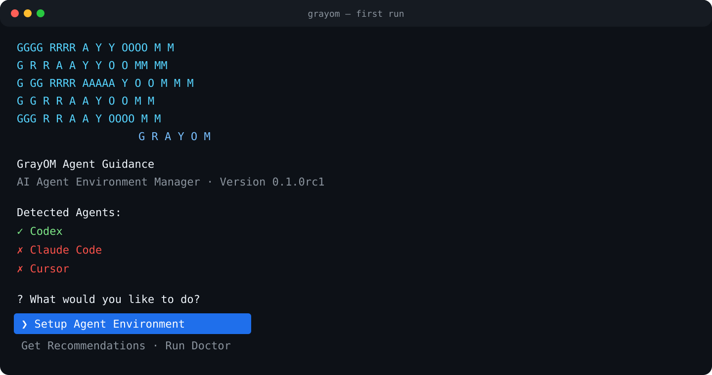

<p align="center">
  
</p>

<h1 align="center">Agent Guidance</h1>

<p align="center"><strong>업무만 선택하면 필요한 AI Agent 확장 구성을 찾아서 설치·검증해 주는 CLI 도구</strong></p>

Agent Guidance은 사용자가 Skill, MCP, Plugin을 직접 공부하거나 고르게 하지 않습니다. 사용하는 Agent와
업무를 선택하면 호환성, 기능 중복, 충돌, 보안 위험을 분석하고 설치 전 전체 Plan을 보여줍니다.

> GrayOM은 Codex, Claude Code 자체를 설치하지 않습니다. 이미 설치된 Agent의 확장 환경만
> 안전하게 설정합니다.

## 빠른 시작

### 1. 준비 사항

- Python 3.11 이상
- Git
- [pipx](https://pipx.pypa.io/stable/installation/)
- Codex, Claude Code 중 하나 이상

### 2. 설치

Windows, macOS, Linux에서 같은 명령을 사용합니다.

```bash
pipx install "git+https://github.com/GrayOM/Agent_Guidance.git@main"
```

### 3. 실행

```bash
grayom
```

이후에는 화면의 선택지만 따라가면 됩니다. 다른 명령어를 외울 필요가 없습니다.



## 어떻게 동작하나요?

1. 설치된 Agent를 찾습니다.
2. 사용할 Agent와 업무 분야, 세부 작업을 선택합니다.
3. GrayOM이 필요한 기능을 내부적으로 추론합니다.
4. Local Registry와 검증된 후보에서 Skill, MCP, Plugin을 추천합니다.
5. 호환성, 중복, 충돌, 권한과 보안 위험을 검사합니다.
6. 실제 변경 내용을 하나의 Plan으로 보여줍니다.
7. 사용자가 한 번 승인하면 설정을 백업한 뒤 설치합니다.
8. Health Check에 실패하면 변경 전 상태로 되돌립니다.

사용자에게 `GitHub MCP가 필요한가?`, `브라우저 자동화가 필요한가?` 같은 기술 질문을 하지 않습니다.
사용자는 자신의 업무만 선택하면 됩니다.

## 사용자가 선택하는 항목

- Agent: Codex, Claude Code
- 업무 분야(대분류, 중복 선택): 일반 개발, 웹 개발, 모바일 개발, AI Agent 개발,
  보안 도구 개발, 취약점 연구, **모의해킹·취약점 진단**, OSINT, DevOps, 데이터 분석, 리서치·문서 작성
- 세부 작업(소분류, 중복 선택): 선택한 대분류마다 다시 묻습니다. 예를 들어 모의해킹·취약점 진단은
  웹앱 진단, 인증 점검, 권한 우회 점검, 인젝션 점검, API 보안 점검, 모바일 앱 진단,
  인프라 모의침투, 재현·PoC, 진단 보고서, 재점검을 묻습니다.
- 구성 모드
  - **Minimal**: 필요한 구성만 최소한으로 설치
  - **Performance**: 전문 구성과 기능 범위를 더 넓게 사용

## 설치 전 확인할 수 있는 내용

최종 Plan에는 다음 내용이 한 번에 표시됩니다.

- 설치할 Skill, MCP, Plugin
- 선택한 이유와 제외한 후보
- Agent별 호환성
- 기능 중복과 설정 충돌
- 파일·네트워크·Shell·Credential 접근 위험
- 변경할 설정과 백업 여부

보안 등급은 `LOW`와 `WARNING`만 사용합니다. `WARNING`은 설치 차단이 아니라 사용자가 승인 전에
확인해야 할 정보입니다.

## 안전하게 변경하는 방식

- 최종 승인 전에는 Agent 설정을 수정하지 않습니다.
- 기존 설정은 덮어쓰지 않고 merge합니다.
- 모든 대상 Agent를 먼저 백업한 뒤 설치를 시작합니다.
- 기존에 사용자가 설치한 Component는 삭제하지 않습니다.
- 설정 parse, Skill discovery, MCP 등록과 실행 가능 여부를 확인합니다.
- 중간 실패 시 새로 만든 항목을 제거하고 기존 설정을 복원합니다.
- Token, password, OAuth 값, SSH key를 로그나 상태 파일에 저장하지 않습니다.

자세한 보안 정책은 [SECURITY.md](SECURITY.md)를 참고하십시오.

## 자주 쓰는 기능

일반 사용자는 `grayom`만 실행하면 됩니다. 문제가 있는 경우에만 아래 명령을 사용합니다.

```bash
grayom doctor    # 현재 Agent 설정 점검
grayom rollback  # 최근 GrayOM 변경 복원
```

설치하지 않고 추천 Plan만 확인하려면:

```bash
grayom setup --dry-run
```

## 업데이트와 제거

업데이트:

```bash
pipx upgrade grayom-agent-guidance
```

제거:

```bash
pipx uninstall grayom-agent-guidance
```

프로그램을 제거해도 이미 적용된 Agent 설정은 자동 복원되지 않습니다. 설정까지 되돌리려면 제거 전에
`grayom rollback`을 실행하십시오.

## 설치 문제 해결

### `grayom` 명령을 찾을 수 없는 경우

```bash
pipx ensurepath
```

명령 실행 후 터미널을 다시 엽니다.

### pipx를 사용할 수 없는 경우

<details>
<summary>Python 가상환경으로 설치하기</summary>

```bash
git clone https://github.com/GrayOM/Agent_Guidance.git
cd Agent_Guidance
python -m venv .venv
```

가상환경을 활성화한 뒤 설치합니다.

```bash
python -m pip install .
grayom
```

Windows PowerShell의 활성화 경로는 `.venv\Scripts\Activate.ps1`, macOS/Linux는
`source .venv/bin/activate`입니다.

</details>

## 지원 범위

| Agent | 감지 | Skill | MCP | Plugin | Health Check / Rollback |
|---|---:|---:|---:|---:|---:|
| Codex | 지원 | 지원 | 지원 | 미지원 | 지원 |
| Claude Code | 지원 | 지원 | 지원 | 지원 | 지원 |

Codex는 자동 설치 대상 Plugin 형식이 없어 Plugin capability가 `false`입니다.

Claude Code Plugin은 `claude plugin` 명령에 위임해 설치하고, GrayOM 트랜잭션으로 감쌉니다.
`claude`를 실행할 수 없으면 Plugin capability가 `false`가 되어 추천에서 제외됩니다. 설치는
marketplace manifest(`.claude-plugin/marketplace.json`)가 선언한 Plugin만 대상으로 하며,
`marketplace add` → `install` 두 단계 모두 이 실행이 추가한 것만 기록해 rollback에서 역순으로
되돌립니다. marketplace가 선언한 명령을 수락해야 하는 Plugin은 자동으로 승인하지 않고 직접
실행할 명령을 안내합니다.

## 데이터 저장 위치

GrayOM의 백업, 캐시, 로그, 상태 정보는 기본적으로 `~/.grayom/`에 저장됩니다. 사용자의 업무 선택
Profile 전체와 Credential 값은 저장하지 않습니다.

## 개발자 문서

- [Architecture](architecture.md)
- [Release audit](docs/release-audit.md)
- [Security policy](SECURITY.md)
- [Contributing](CONTRIBUTING.md)
- [Changelog](CHANGELOG.md)

현재 버전은 `0.1.0rc1` Release Candidate입니다.

## License

MIT
