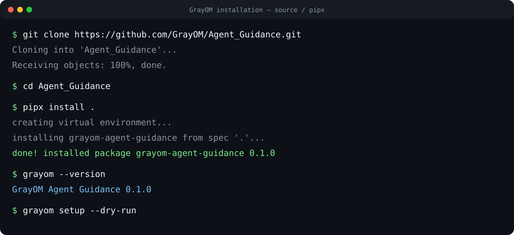
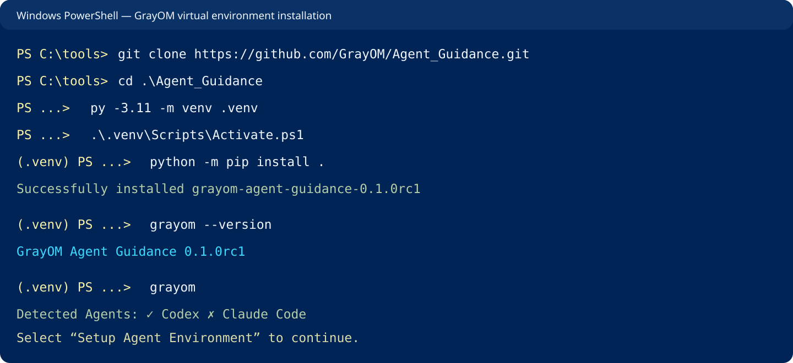

# GrayOM Agent Guidance

업무 중심 인터뷰로 AI Agent용 Skill, MCP, Plugin을 추천하고 기존 Agent 환경에 안전하게 적용하는 CLI입니다.

## What is GrayOM Agent Guidance?

GrayOM은 사용자가 Skill이나 MCP 구현을 직접 고르게 하지 않습니다. 선택한 Agent, 업무 분야, 세부
작업에서 필요한 capability를 결정적으로 추론하고 Local Registry, 공식 프로젝트, GitHub 후보를
검증합니다. 이후 호환성, 중복, 충돌, 유지보수 상태, 권한과 보안 신호를 분석해 Agent별 변경 Plan을
만듭니다.

GrayOM은 Agent나 Node.js, Python, Docker, Git, IDE를 설치하지 않습니다. 이미 설치된 Agent의 AI
확장 환경만 관리합니다.

## Supported Agents

- Codex
- Claude Code
- Cursor

Agent별 지원 범위가 다르면 지원되는 Agent에만 적용합니다. `UNKNOWN` 호환성을 자동으로
`SUPPORTED`로 취급하지 않습니다.

## Features

- 업무/세부 작업 복수 선택과 Minimal/Performance 모드
- Local Registry, 공식 catalog, GitHub 실시간 후보 탐색과 검증 캐시
- 결정적 capability inference와 추천 근거 설명
- Agent별 compatibility 및 version requirement 분석
- Skill/MCP/Plugin 중복, capability overlap, config/tool/path 충돌 분석
- LOW/WARNING 보안 검토와 repository 정적 증거
- shared MCP 1회 준비 및 Agent별 설정 참조
- 기존 구성 reconciliation과 반복 실행 idempotency
- 모든 Agent 선백업 후 적용하는 전역 transaction
- 통합 Health Check와 전체 rollback
- GrayOM-managed component update
- dry-run, doctor, sanitized debug info, JSONL event log
- explicit transaction lifecycle, crash recovery, concurrent-operation lock, and component hash manifests
- shared timeout-bound process runner and managed-path/symlink validation

## Installation

### 1. 설치 전 확인

GrayOM은 Agent 자체를 설치하지 않습니다. 아래 항목을 먼저 준비합니다.

- Python 3.11 이상
- 설정할 Agent 중 하나 이상: Codex, Claude Code, Cursor
- Git
- 권장: [pipx](https://pipx.pypa.io/stable/installation/)

버전을 확인합니다.

```bash
python --version
git --version
pipx --version
```

### 2. 권장 설치: pipx

현재 `0.1.0rc1`은 PyPI에 게시하지 않았으므로 GitHub source에서 설치합니다. `main` 브랜치를 clone한
다음 repository root에서 실행합니다.

```bash
git clone https://github.com/GrayOM/Agent_Guidance.git
cd Agent_Guidance
pipx install .
```

`pipx`는 GrayOM 전용 가상환경과 `grayom` 명령을 생성하므로 일반 Python 환경을 변경하지 않습니다.



설치 확인:

```bash
grayom --version
grayom --help
```

`grayom` 명령을 찾지 못하면 터미널을 다시 열거나 다음 명령을 실행합니다.

```bash
pipx ensurepath
```

### 3. 가상환경 설치

`pipx`를 사용하지 않는 경우 프로젝트 전용 가상환경에 설치합니다.

Linux / macOS:

```bash
git clone https://github.com/GrayOM/Agent_Guidance.git
cd Agent_Guidance
python3 -m venv .venv
source .venv/bin/activate
python -m pip install --upgrade pip
python -m pip install .
grayom --version
```

Windows PowerShell:

```powershell
git clone https://github.com/GrayOM/Agent_Guidance.git
Set-Location .\Agent_Guidance
py -3.11 -m venv .venv
.\.venv\Scripts\Activate.ps1
python -m pip install --upgrade pip
python -m pip install .
grayom --version
```



PowerShell에서 실행 정책 오류가 발생하면 현재 터미널 프로세스에만 적용합니다.

```powershell
Set-ExecutionPolicy -Scope Process -ExecutionPolicy Bypass
.\.venv\Scripts\Activate.ps1
```

### 4. 최초 실행

```bash
grayom
```

GrayOM이 설치된 Agent를 표시한 뒤 Setup, Recommend, Doctor, Update, Rollback 중 수행할 작업을
선택합니다. `setup`에서는 업무 분야와 세부 작업만 선택하며 Skill/MCP/Plugin을 직접 선택하지 않습니다.


설치 전에 변경 Plan만 확인하려면 다음 명령을 먼저 실행하는 것을 권장합니다.

```bash
grayom setup --dry-run
```

실제 설치는 Plan 전체에 대해 한 번만 승인받으며, 승인 전에는 Agent 설정이나 backup을 만들지 않습니다.

### 5. 업데이트와 제거

GitHub source를 최신 상태로 받은 뒤 재설치합니다.

```bash
cd Agent_Guidance
git pull --ff-only
pipx uninstall grayom-agent-guidance
pipx install .
```

GrayOM 프로그램만 제거:

```bash
pipx uninstall grayom-agent-guidance
```

프로그램 제거는 이미 적용된 Agent 설정을 자동으로 되돌리지 않습니다. 설정을 되돌릴 필요가 있으면
프로그램 제거 전에 `grayom rollback`을 실행합니다.

### 6. 개발 환경

```bash
python -m venv .venv
source .venv/bin/activate  # Windows: .\.venv\Scripts\Activate.ps1
python -m pip install -r requirements-dev.lock
python -m pip install -e . --no-deps
python -m pytest -q
```

## Usage

```bash
grayom                 # interactive menu
grayom setup           # recommend, approve once, install, verify
grayom setup --dry-run # no backup or mutation
grayom recommend       # Plan only
grayom doctor          # read-only diagnosis
grayom update          # GrayOM-managed components only
grayom rollback        # latest transaction
grayom debug-info      # sanitized diagnostic JSON
grayom --version
```

네트워크 없이 Registry와 검증 캐시만 사용하려면:

```bash
grayom setup --offline
grayom recommend --offline
```

GitHub API 인증은 환경변수로만 제공합니다.

```bash
export GITHUB_TOKEN="..."
export GITHUB_PAT_TOKEN="..."  # GitHub MCP가 요구하는 경우
```

## Example

`Codex + Claude Code + Cursor`, `Security Tool Development`, `Source Code Analysis`, `Minimal`을
선택하면 GrayOM은 필요한 capability를 추론하고 전체 후보를 추천한 뒤 Agent별 지원 여부를 다시
평가합니다. 공통 MCP는 한 번 준비하고 각 Agent의 공식 설정 포맷에 별도로 등록합니다. 설치 승인은
Plan 전체에 대해 한 번만 받습니다.

## Configuration and State

GrayOM 데이터는 기본적으로 `~/.grayom/` 아래에 저장합니다.

```text
~/.grayom/
├── config.yaml
├── cache/
├── backups/
├── logs/
└── state/
```

`GRAYOM_HOME`으로 위치를 바꿀 수 있습니다. 업무 Profile 전체는 저장하지 않습니다. state에는
GrayOM이 관리하는 component ID, Agent 사용 관계, ownership, source ref, transaction 참조와
설치 경로·생성 파일 SHA-256을 기록합니다. credential 값은 포함하지 않습니다.

## Security Model

- 승인 전 Agent 설정을 수정하거나 backup을 만들지 않습니다.
- 설정은 parse → merge → validate → atomic replace 순서로 처리합니다.
- 사용자 기존 component와 충돌하는 MCP 이름은 보존하고 안전한 `-grayom` 별칭을 사용합니다.
- rollback은 GrayOM marker와 manifest로 소유권이 확인된 경로만 제거합니다.
- 원격 README의 shell 명령을 실행하지 않으며 모든 child process는 argument list와 timeout을 사용합니다.
- token, password, OAuth 값, SSH key, `.env` secret은 state/log에 저장하지 않습니다.
- WARNING은 차단 등급이 아니며 최종 Plan에 근거와 함께 표시합니다.

자세한 내용은 [SECURITY.md](SECURITY.md)를 참고하십시오.

## Supported Platforms

Linux, macOS, Windows의 사용자 home 경로를 `pathlib`으로 처리합니다. WSL은 감지하지만 WSL에서
Windows 호스트에 설치된 Cursor 설정을 추측해 수정하지 않고 경고만 표시합니다.

## Limitations

- Claude Code Plugin은 검증된 marketplace 식별자 없이 임의 Git URL만으로 자동 설치하지 않습니다.
- Cursor Plugin은 공식 Marketplace/API의 transaction-safe 설치 방식이 확인될 때까지 Plan에서 제외합니다.
- Codex는 HTTP MCP initialize/tool discovery를 시도할 수 있지만 Claude Code/Cursor의 현재 Health
  Check는 설정 parse, discovery metadata, endpoint/command 유효성 중심입니다.
- `grayom update`는 현재 Local Registry의 검증된 ref 변경을 기준으로 동작합니다. live upstream
  release 비교와 자동 migration은 후속 범위입니다.
- WSL과 Windows host 사이의 cross-environment 설정 변경은 지원하지 않습니다.
- 새 추천에서 제외된 기존 GrayOM component를 자동 삭제하지 않습니다.
- JSON 기반 Agent 설정은 알 수 없는 key를 보존하지만 whitespace/key formatting은 정규화될 수 있습니다.
- Windows/macOS/Linux fixture CI는 제공하지만 실제 Agent 애플리케이션을 설치한 물리 환경 검증은
  `0.1.0rc1`에서 `NOT VERIFIED`입니다.

현재 버전은 `0.1.0rc1` Release Candidate입니다. 안정 릴리스 판정과 남은 검증은
[RC 감사](docs/release-audit.md)에 기록합니다.

## Development

```bash
python -m compileall -q src tests
python -m pytest -q --cov=grayom_agent_guidance
```

Architecture는 [architecture.md](architecture.md)에 정리되어 있습니다.

## License

MIT
