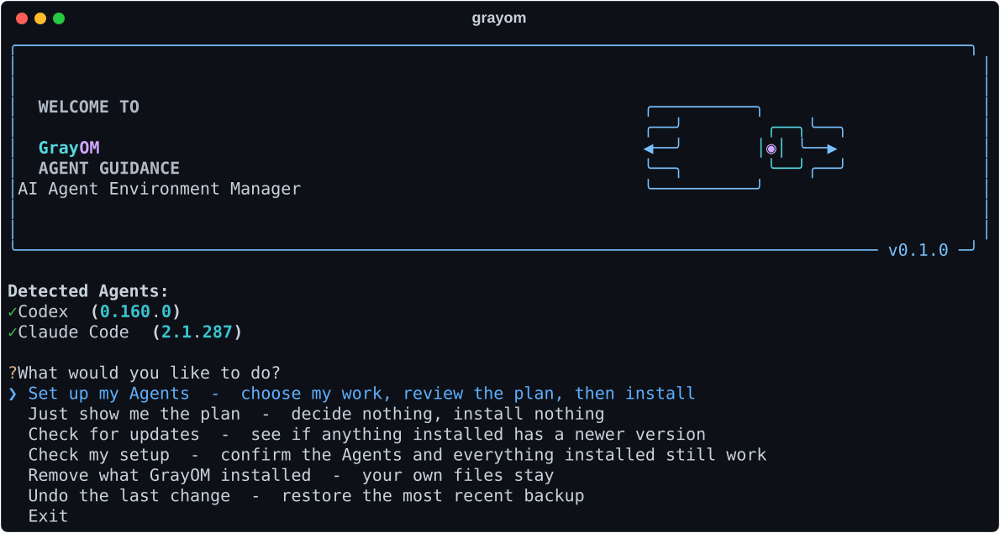
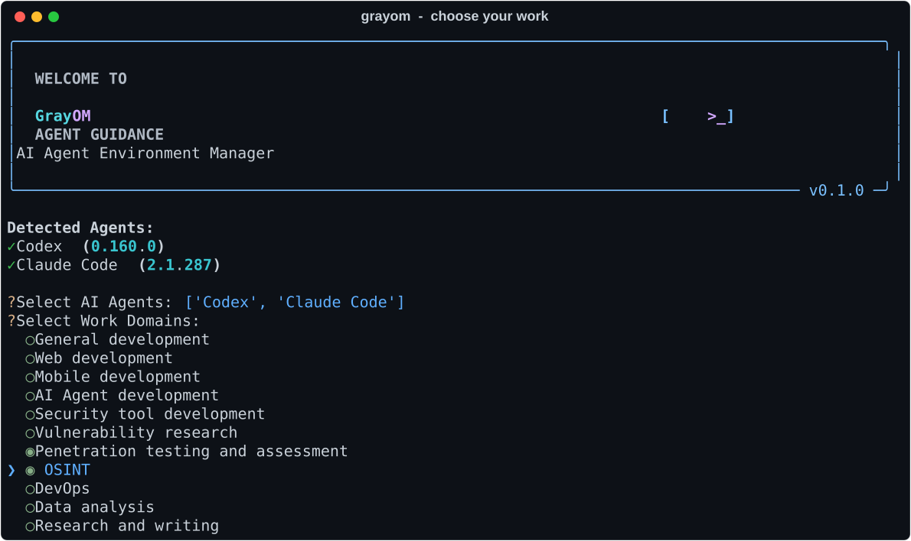
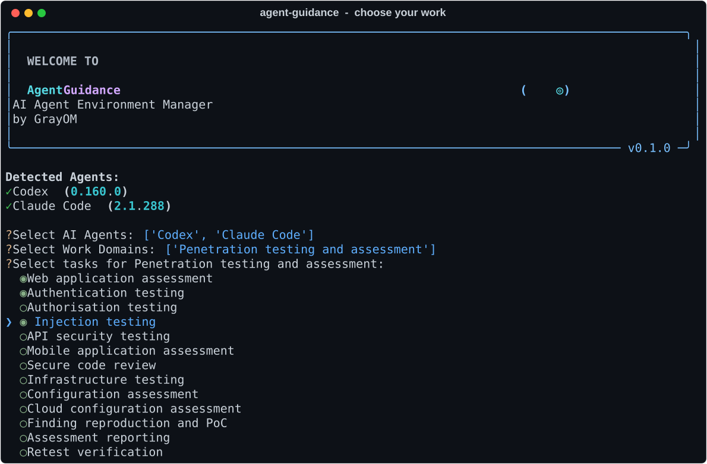
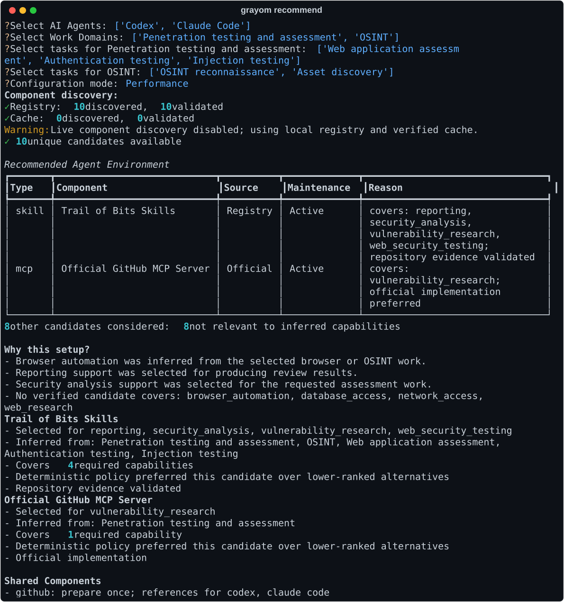
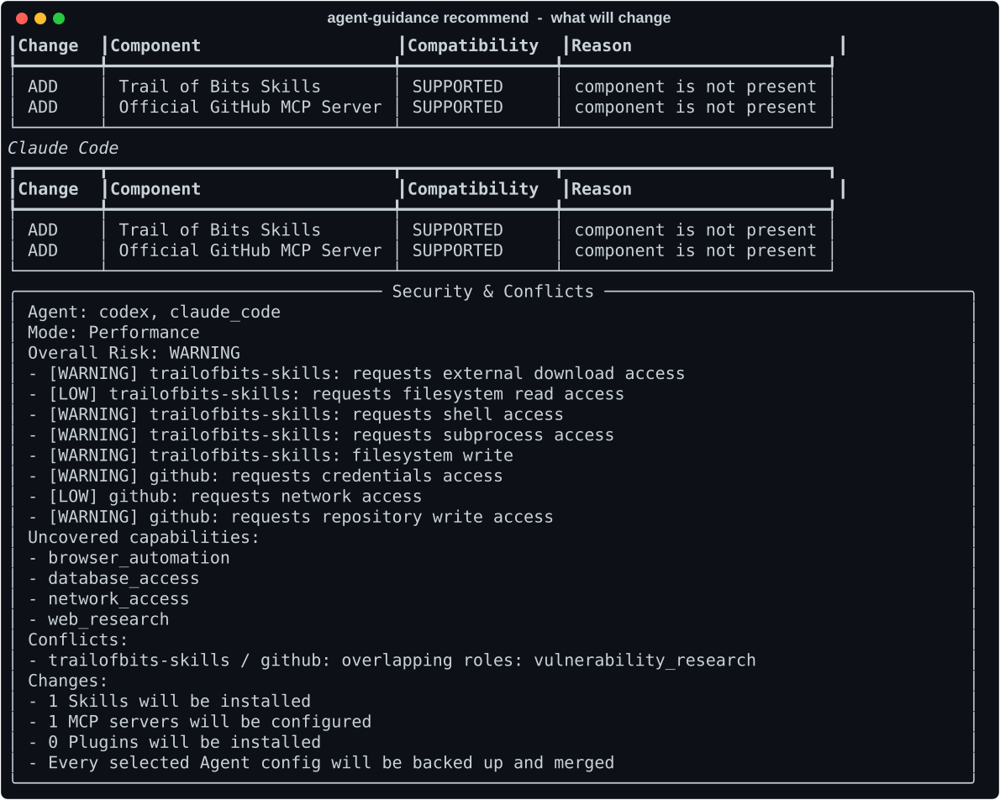
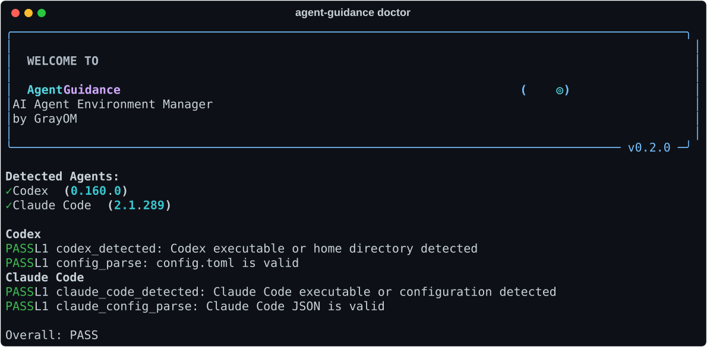
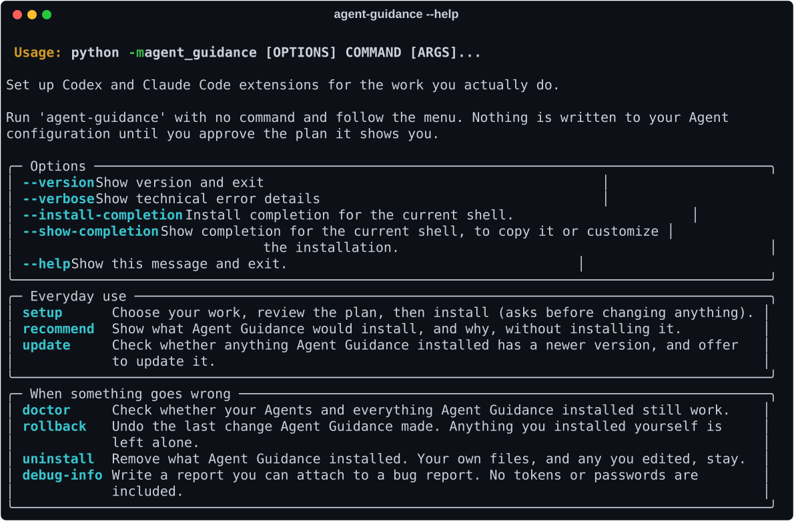

<p align="center">
  
</p>

<h1 align="center">GrayOM Agent Guidance</h1>

<p align="center">
  <strong>Codex와 Claude Code를 설치한 다음, 뭘 깔아야 할지 대신 정해주는 CLI</strong>
</p>

<p align="center">
  하는 일을 고르면 됩니다. Skill·MCP·Plugin 이름을 알 필요도, 고를 필요도 없습니다.
</p>

---

## 명령어는 하나입니다

```bash
grayom
```

나머지는 전부 화살표 키와 Enter로 끝납니다.



설치된 Agent를 먼저 찾아서 버전과 함께 보여주고, 할 일을 고르게 합니다. 각 줄이 **선택하면 무슨 일이
일어나는지**까지 적혀 있으니 처음 써도 어떤 걸 눌러야 할지 고민할 필요가 없습니다.

> 이 문서의 모든 스크린샷은 실제로 프로그램을 돌려서 캡처한 것입니다
> (`python scripts/capture_screens.py`). 손으로 그린 그림이 아닙니다.

---

## 설치

Windows, macOS, Linux 모두 같은 명령입니다.

```bash
pipx install "git+https://github.com/GrayOM/Agent_Guidance.git@main"
```

<details>
<summary>준비물과, pipx가 없을 때</summary>

필요한 것:

- Python 3.11 이상
- Git
- Codex 또는 Claude Code 중 **하나 이상이 이미 설치되어 있어야** 합니다
  (GrayOM은 Agent 자체를 설치하지 않습니다)

pipx가 없다면 [pipx 설치 문서](https://pipx.pypa.io/stable/installation/)를 보시거나, 가상환경으로
설치할 수 있습니다.

```bash
git clone https://github.com/GrayOM/Agent_Guidance.git
cd Agent_Guidance
python -m venv .venv
```

가상환경을 활성화한 뒤 (Windows PowerShell은 `.venv\Scripts\Activate.ps1`,
macOS·Linux는 `source .venv/bin/activate`):

```bash
python -m pip install .
grayom
```

`grayom` 명령을 찾을 수 없다고 나오면 `pipx ensurepath`를 실행하고 터미널을 다시 여십시오.
그래도 안 되면 `python -m grayom_agent_guidance`로도 똑같이 실행됩니다.

</details>

---

## 쓰는 순서

### 1. 분야를 고릅니다 (복수 선택)



Space로 체크, Enter로 다음. 설치된 Agent는 **미리 체크되어** 있으니 그대로 Enter를 눌러도 됩니다.

고를 수 있는 분야는 11개입니다.

| | |
|---|---|
| General development | 일반 개발 |
| Web development | 웹 개발 |
| Mobile development | 모바일 개발 |
| AI Agent development | AI Agent 개발 |
| Security tool development | 보안 도구 개발 |
| Vulnerability research | 취약점 연구 |
| **Penetration testing and assessment** | **모의해킹·취약점 진단** |
| OSINT | OSINT |
| DevOps | DevOps |
| Data analysis | 데이터 분석 |
| Research and writing | 리서치·문서 작성 |

### 2. 세부 작업을 고릅니다 (복수 선택)

고른 분야마다 한 번씩 더 묻습니다. 여기가 추천의 정확도를 결정하는 부분입니다.



모의해킹·취약점 진단은 위처럼 13개를 묻습니다 — 웹앱 진단, 인증 점검, 권한 우회 점검, 인젝션 점검,
API 보안 점검, 모바일 앱 진단, 소스코드 보안 점검, 인프라 모의침투, 설정 취약점 진단,
클라우드 설정 진단, 재현·PoC, 진단 보고서, 재점검. 전체 11개 분야에 세부 작업이 78개 있습니다.

마지막으로 구성 모드를 고릅니다.

- **Minimal** — 꼭 필요한 것만 최소로
- **Performance** — 전문 구성까지 넓게

> `GitHub MCP가 필요한가요?` 같은 건 묻지 않습니다. 하는 일만 고르면 필요한 기능은 GrayOM이
> 역으로 추론합니다.

### 3. 설치 전에 전부 보여줍니다



- 설치할 Skill·MCP·Plugin과 **그걸 고른 이유**
- 어떤 선택에서 그 기능이 추론됐는지 (`Inferred from:`)
- 검토했지만 **제외한 후보** 개수와 사유
- 아무 후보도 못 채운 기능 (`No verified candidate covers:`) — 과장하지 않고 못 채운 건 못 채웠다고 적습니다

이어서 Agent별로 실제 변경 내용과 보안 검토 결과가 나옵니다.



- Agent별 ADD/SKIP과 호환성
- 파일·네트워크·Shell·Credential 접근 위험 (`LOW` / `WARNING`)
- 기능이 겹치는 구성요소 (`Conflicts`)
- 몇 개가 설치되고, 기존 설정은 백업·merge된다는 사실

`WARNING`은 설치를 막는 게 아니라 **승인 전에 알고 있어야 할 정보**입니다. 여기서 Enter를 누르기
전까지 Agent 설정 파일은 한 글자도 바뀌지 않습니다.

---

## 안전장치

- 최종 승인 전에는 아무것도 쓰지 않습니다.
- 기존 설정은 덮어쓰지 않고 **merge**합니다. 주석, 직접 등록한 MCP 서버, 기존 옵션 모두 유지됩니다.
- 설치 전에 대상 Agent를 **전부 백업**합니다.
- 직접 설치한 Component는 건드리지 않습니다.
- 중간에 실패하면 새로 만든 것만 지우고 원래 상태로 되돌립니다.
- Token, password, OAuth 값, SSH key는 로그·상태 파일에 저장하지 않습니다.

자세한 내용은 [SECURITY.md](SECURITY.md)에 있습니다.

---

## 문제가 생겼을 때

평소에는 `grayom` 하나면 됩니다. 아래는 뭔가 이상할 때만 쓰십시오.

```bash
grayom doctor      # Agent와 설치된 것들이 아직 정상인지 점검
grayom rollback    # 마지막 변경 되돌리기
grayom uninstall   # GrayOM이 설치한 것 제거 (직접 만든 파일은 남김)
grayom debug-info  # 버그 리포트에 첨부할 진단 정보 (토큰·비밀번호 미포함)
```



전부 메뉴에서도 똑같이 고를 수 있습니다. 명령어를 외울 필요는 없습니다.

<details>
<summary><code>grayom --help</code> 전체</summary>



</details>

### 업데이트와 제거

```bash
pipx upgrade grayom-agent-guidance    # GrayOM 자체 업데이트
pipx uninstall grayom-agent-guidance  # GrayOM 제거
```

GrayOM을 지워도 이미 적용된 Agent 설정은 자동으로 돌아오지 않습니다. 설정까지 되돌리려면 지우기 전에
`grayom rollback` 또는 `grayom uninstall`을 먼저 실행하십시오.

---

## 지원 범위

| Agent | 감지 | Skill | MCP | Plugin | 점검 / 되돌리기 |
|---|:---:|:---:|:---:|:---:|:---:|
| Codex | O | O | O | — | O |
| Claude Code | O | O | O | O | O |

Codex는 자동 설치할 Plugin 형식 자체가 없습니다.

Claude Code Plugin은 `claude plugin` 명령에 위임하고 GrayOM 트랜잭션으로 감쌉니다. `claude`를
실행할 수 없으면 Plugin은 추천에서 빠집니다. marketplace manifest가 선언한 Plugin만 설치하며,
`marketplace add` → `install` 두 단계 모두 이번 실행이 추가한 것만 기록해 역순으로 되돌립니다.
**marketplace가 선언한 명령을 수락해야 하는 Plugin은 자동 승인하지 않고**, 직접 실행할 명령을
안내만 합니다.

---

## 알아두면 좋은 것

- 상태·백업·캐시·로그는 `~/.grayom/`에 저장됩니다. 업무 선택 Profile 전체와 Credential 값은
  저장하지 않습니다.
- 추천 후보는 내장 Registry와 GitHub에서 가져옵니다. `GITHUB_TOKEN`이 있으면 후보 수가 늘어나고,
  없어도 동작합니다.
- 네트워크 없이 쓰려면 `grayom setup --offline` — 내장 Registry와 검증된 캐시만 사용합니다.
  위 Plan 스크린샷이 이 모드로 캡처한 것이라, 실제로는 후보가 더 많습니다.
- `grayom uninstall`은 **설치 후 직접 수정한 Skill은 지우지 않습니다.** 고쳐 쓴 파일을 프로그램이
  삭제하면 안 되기 때문입니다. 이 경우 어느 디렉터리가 남았는지 경로까지 알려주니, 필요 없으면
  직접 지우시면 됩니다.

---

## 개발자 문서

- [Architecture](architecture.md)
- [Security policy](SECURITY.md)
- [Release audit](docs/release-audit.md)
- [Contributing](CONTRIBUTING.md)
- [Changelog](CHANGELOG.md)

현재 버전은 `0.1.0`입니다.

## License

MIT
